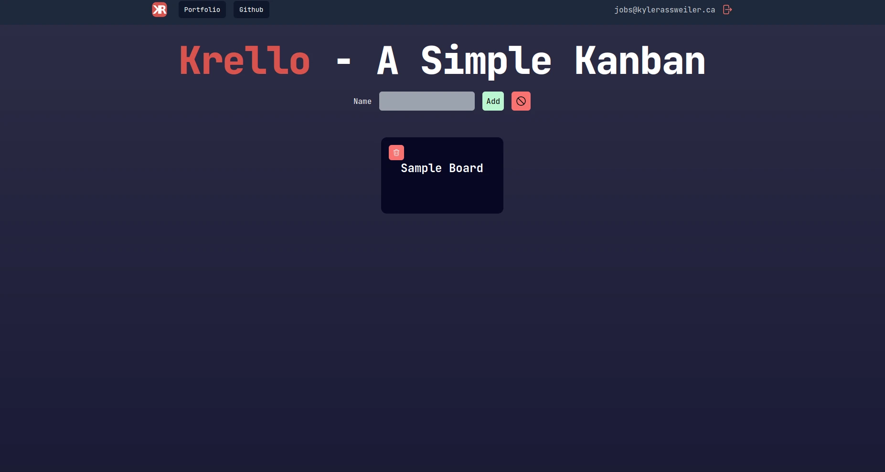
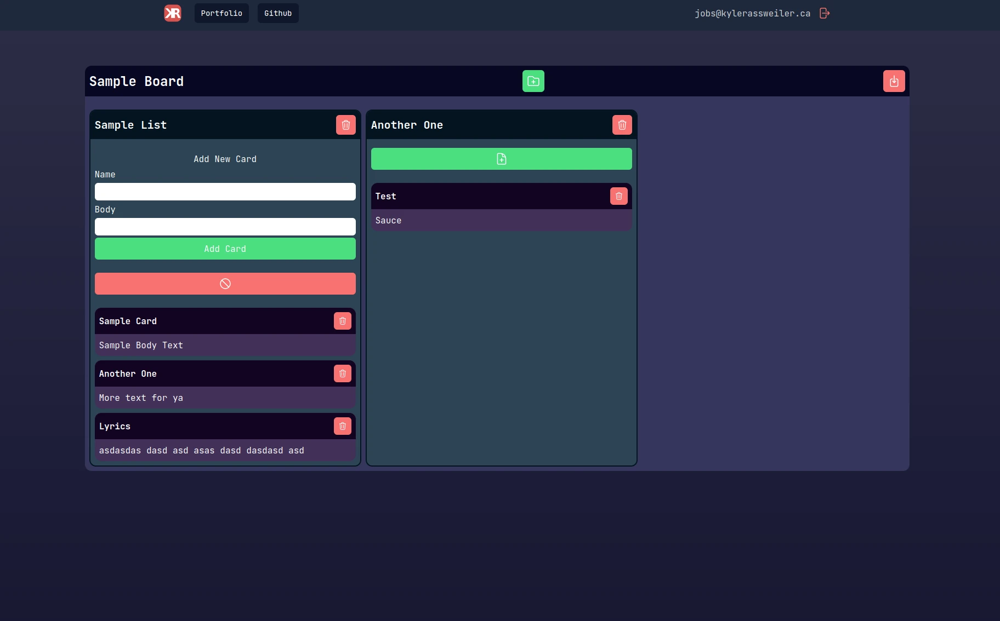

# Krello

This is a kanban project bootstrapped with `create-t3-app`.  

## What's the point of this project?

To learn next, prisma, trpc, and zod.  

## Demo

A demo is hosted on vercel and prisma: [Demo](https://krello.kylerassweiler.ca)

## Screenshots
  
  

## Todo:
- [x] Setup consistent styling.
- [x] Update state on change.
- [] Add Show/Hide add card form option.
- [] Add option to edit cards.
- [] Add option to edit lists.
- [] Add option to edit boards.
